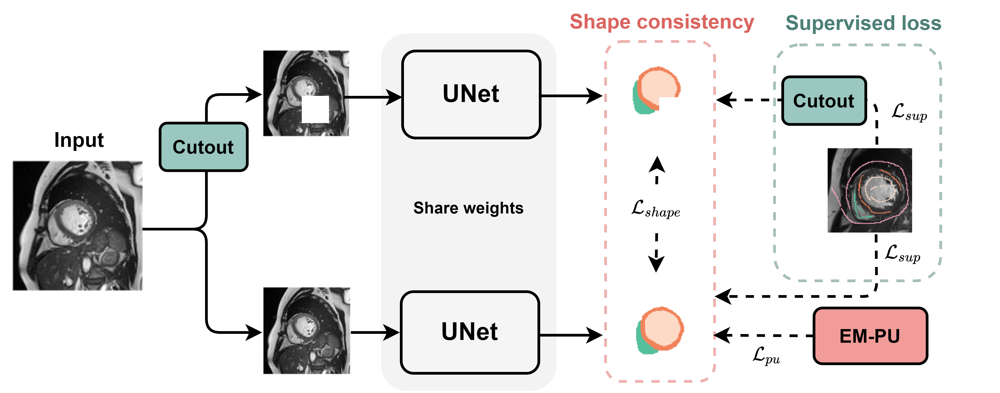

# ShapePU
This project is developed for our MICCAI 2022 paper: ShapePU: A New PU Learning Framework  Regularized by Global Consistency for Scribble Supervised Cardiac Segmentation.
<div align=center></div>

# Datasets
1. The MSCMR dataset with mask annotations can be downloaded from [MSCMRseg](https://zmiclab.github.io/zxh/0/mscmrseg19/data.html).
2. Our scribble annotations of MSCMRseg have been released in [MSCMR_scribbles](https://github.com/BWGZK/CycleMix/tree/main/MSCMR_scribbles).
3. The scribble-annotated MSCMR dataset used for training could be directly downloaded from [MSCMR_dataset](https://github.com/BWGZK/CycleMix/tree/main/MSCMR_dataset). 
4. The ACDC dataset with mask annotations can be downloaded from [ACDC](https://www.creatis.insa-lyon.fr/Challenge/acdc/) and the scribble annotations could be downloaded from [ACDC scribbles](https://vios-s.github.io/multiscale-adversarial-attention-gates/data). Please organize the dataset as the following structure:
```
XXX_dataset/
  -- TestSet/
      --images/
      --labels/
  -- train/
      --images/
      --labels/
  -- val/
      --images/
      --labels/
```

# Usage
1. Set the "dataset" parameter in main.py, line 55, to the name of dataset, i.e., "MSCMR_dataset".
2. Set the "output_dir" in main.py, line 57, as the path to save the checkpoints. 
3. Download the dataset, for example, the [MSCMR_dataset](https://github.com/BWGZK/CycleMix/tree/main/MSCMR_dataset). Then, Set the dataset path in /data/mscmr.py, line 110, to your data path where the dataset is located in.
4. Check your GPU devices and modify the "GPU_ids" parameter in main.py, line 61.
Start training with:
```
python main.py
```
If you have any problems, please feel free to contact us. Thanks for your attention.

# Requirements

This code has been tested with  
Python 3.8.5  
torch  1.7.0  
torchvision 0.8.0  


If you have any problems, please feel free to contact us. We will release the trained models as soon as possible. Thanks for your attention.
